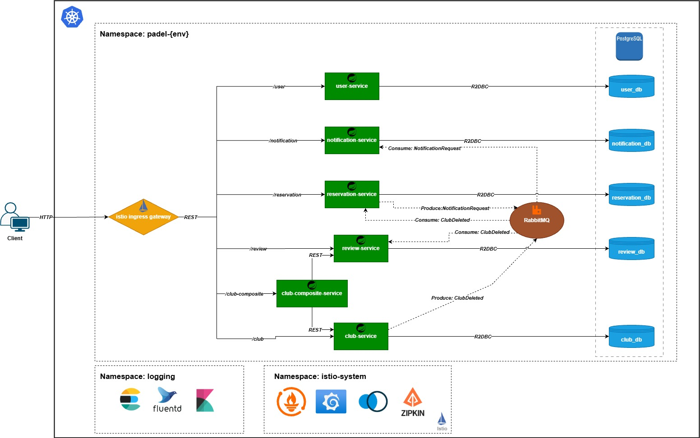

# Padel Court Reservation System

## 1. System Description

The Padel Court Reservation System is a microservices-based application developed to to manage padel clubs, user accounts, court bookings, and community reviews. Developed as a university project for the course "Distributed Information Systems," the application is bulit with patterns popularized in Magnus Larsson's Hands on Microservices with Spring Boot and Spring Cloud. The system implements a decoupled architecture where core logic is distributed across independent services, utilizing RabbitMQ for asynchronous event-driven consistency and an Istio-based service mesh for traffic management. By integrating service discovery, circuit breakers, and fault injection into a Kubernetes environment, the platform demonstrates a resilient distributed system designed for scalability and high availability.

**User Roles and Permissions**
* **USER:** Any individual can register for a USER account. USERS can view all clubs, create reservations for themselves, and view their own booking history. They can post one review per club and delete only their own reviews.
* **ADMIN:** Users with the ADMIN role manage club data, including creating, updating, and deleting club entries. They can view all reservations across the system, delete users with the USER role, and manually send system notifications.
* **OWNER:** The OWNER role holds the highest level of authority, with the unique ability to create and delete ADMIN accounts.

**Microservices**
* **club-service:** Handles user registration, authentication, and profile management using JWT for identity propagation.
* **user-service:** Manages club metadata, including names, locations, and contact information.
* **reservation-service:** Processes court bookings and maintains the reservation schedule.
* **notification-service:** Manages club ratings and feedback from users.
* **review-service:** Handles system alerts and booking confirmations via asynchronous messaging.
* **reservation-service:** Aggregates data from multiple core services (e.g., club details combined with reviews) to provide a unified view for the client.

**DescrBusiness Logic and Event Orchestration**
* **Identity Management:** Users can only update their own profiles. Identity is verified via Istio Ingress headers passed to downstream services.
* **Cascading Deletions:** When an ADMIN deletes a club, the system publishes a club.deleted event to RabbitMQ. The reservation and review services subscribe to this event to automatically delete all associated bookings and reviews.
* **Automated Notifications:** Upon successful creation of a reservation, the system automatically triggers a notification message to inform the user.


## 2. Technology Stack

The system utilizes a cloud-native architecture with the following core technologies:

* **Backend Framework:** Spring Boot (WebFlux)
* **Containerization:** Docker
* **Orchestration:** Kubernetes
* **Service Mesh:** Istio handling Ingress, Request Authentication (JWT), and Authorization Policies.
* **Database:** PostgreSQL (with R2DBC for reactive access)
* **Message Broker:** RabbitMQ (handling asynchronous events like `club.deleted` and notifications)
* **Resilience:** Istio DestinationRules for overflow protection and fault injection testing
* **Monitoring:** Prometheus and Grafana
* **Logging:** EFK Stack (Elasticsearch, Fluentd, Kibana)
* **CI/CD:** GitHub Actions

## 3. System diagram



## 4. CI/CD Instructions

The project utilizes GitHub Actions for Continuous Integration and Continuous Deployment. The pipeline configuration is located in `.github/workflows/padel-ci-cd.yml`.

**Pipeline Structure**

* **Build Job**
    * **Trigger:** Pushes to `main` or `develop` branches.
    * **Action:** Sets up JDK 17, installs shared libraries (`util`, `api`), and compiles all microservices using Maven (`mvn clean package -DskipTests`).

* **Test Job**
    * **Trigger:** Runs automatically after a successful Build.
    * **Action:** Executes Unit and Integration tests for all services (`mvn test`) and uploads reports as artifacts.

* **Deploy Job**
    * **Trigger:** Runs after successful Test.
    * **Development Strategy:** Pushes to the `develop` branch trigger a build of Docker images tagged with the short Git commit SHA (e.g., `user-service:a1b2c3d`).
    * **Production Strategy:** Pushing a git tag starting with `v` (e.g., `v1.0.0`) triggers a build of Docker images tagged with the version number and `:latest`.
    * **Registry:** Images are pushed to Docker Hub using configured secrets.

**Execution Guide**

* **To Deploy to Development:**
    Push changes to the `develop` branch:
    ```bash
    git push origin develop
    ```

* **To Deploy to Production:**
    Create and push a version tag:
    ```bash
    git tag v1.0.0
    git push origin v1.0.0
    ```

## 5. Local Deployment Instructions

Follow these steps to deploy the entire system locally using Minikube.

**Prerequisites**
* Docker Desktop
* Minikube
* kubectl
* istioctl

**Startup**

Execute the provided startup script to initialize the cluster, install Istio, build local images, and apply Kubernetes manifests:

```bash
./run-on-minikube.sh
```

Run the following command in a separate terminal to enable external access:

```bash
minikube tunnel
```

Wait for all pods to be ready in the `padel-dev` namespace:

```bash
kubectl get pods -n padel-dev
```

**Shutdown**

To stop the cluster and remove resources:

```bash
./stop-minikube.sh
```

**Functional & Security Testing**

The project includes a suite of automated shell scripts to verify system functionality, security, resilience, and observability.

* **Script:** `./test-endpoints.sh`
* **Purpose:** Verifies core business logic (user hierarchy, reservations, reviews) and Role-Based Access Control (RBAC). It ensures that unauthorized users cannot perform privileged actions and checks data consistency (e.g., cascading deletion).
* **Execution:**

    ```bash
    ./test-endpoints.sh
    ```

**Resilience & Fault Tolerance Testing**

* **Script:** `./test-resilience.sh` 
* **Purpose:** Demonstrates Istio Service Mesh resilience capabilities.
    * **Circuit Breaker:** Applies connection limits to `review-service` and floods it with traffic to verify that the circuit breaker trips (503 errors) to prevent system overload.
    * **Fault Injection:** Injects simulated HTTP 500 errors into `review-service` to verify that `club-composite-service` handles the failure gracefully (fallback mechanism).
* **Execution:**

    ```bash
    ./test-resilience.sh
    ```

**Monitoring & Alerting Testing**

* **Script:** `./test-alerts.sh`
* **Purpose:** Triggers specific failure conditions to verify Prometheus alerting rules.
    * **CircuitBreakerTripped:** Generates high load to trip the circuit breaker and fire a critical alert.
    * **ServiceDown:** Scales the `notification-service` to 0 replicas to trigger a warning alert.
* **Verification:** Alerts are sent to the simulated email server (MailHog) at `http://localhost:8025` ( in seraprate terminal run `kubectl port-forward -n istio-system svc/mailhog -p 8025:8025` ).
* **Execution:**

    ```bash
    ./test-alerts.sh
    ```
